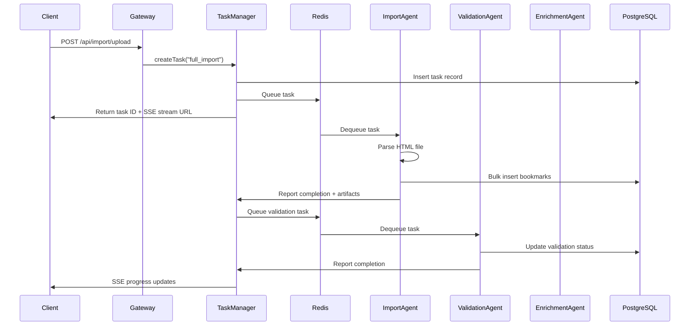

# A2A-Compliant Rust Architecture

## Overview

This document describes the proper A2A (Agent2Agent) architecture for the Rust bookmark manager, following Google's A2A standards and maintaining compatibility with the existing Node.js A2A implementation.

## Core Components

### 1. A2A Task Manager (Rust)
- Manages task lifecycle
- Orchestrates agent workflows
- Integrates with Redis for distributed processing
- Provides SSE endpoints for real-time updates

### 2. Agent System

#### Bookmark Import Agent
**Primary Role**: Parse HTML bookmark files and load raw data into PostgreSQL
- Parses bookmark HTML files
- Extracts URLs, titles, folders, dates
- Performs bulk inserts into PostgreSQL
- Creates artifacts with bookmark IDs for downstream agents
- **No validation or enrichment** - just raw data loading

#### Validation Agent  
**Role**: Validate URLs and check availability
- Receives bookmark IDs from Import Agent
- Uses Playwright browser pool for validation
- Updates validation_status in database
- Creates validation report artifacts

#### Enrichment Agent
**Role**: Extract metadata and enhance bookmark data
- Fetches page titles, descriptions, favicons
- Extracts Open Graph metadata
- Updates bookmark records with enriched data
- Creates enrichment artifacts

#### Categorization Agent
**Role**: AI-powered categorization and tagging
- Uses Claude/OpenAI to analyze content
- Assigns categories and tags
- Creates categorization artifacts

#### Embedding Agent
**Role**: Generate vector embeddings for semantic search
- Creates text embeddings for each bookmark
- Stores in bookmark_embeddings table
- Enables semantic search capabilities

## A2A Task Flow



## Redis Queue Structure

### Task Queue
```json
{
  "taskId": "task_1234567_abc",
  "type": "bookmark_import",
  "priority": 1,
  "attempts": 0,
  "data": {
    "userId": "user_123",
    "filePath": "/tmp/bookmarks.html",
    "workflowType": "full_import"
  },
  "createdAt": "2025-06-18T21:30:00Z"
}
```

### Agent-Specific Queues
- `import_queue` - For bookmark parsing tasks
- `validation_queue` - For URL validation tasks  
- `enrichment_queue` - For metadata extraction
- `categorization_queue` - For AI categorization
- `embedding_queue` - For vector generation

## A2A Compliance

### AgentCard Format
Each agent exposes `/.well-known/agent.json`:
```json
{
  "name": "bookmark-import-agent",
  "version": "1.0.0",
  "description": "Parses bookmark files and loads into database",
  "capabilities": {
    "inputs": {
      "filePath": {"type": "string", "required": true},
      "userId": {"type": "string", "required": true},
      "taskId": {"type": "string", "required": true}
    },
    "outputs": {
      "bookmarkIds": {"type": "array"},
      "totalCount": {"type": "number"},
      "artifacts": {"type": "array"}
    }
  },
  "endpoints": {
    "execute": "/execute",
    "status": "/status/{taskId}",
    "health": "/health"
  }
}
```

### Task Structure
```rust
pub struct A2ATask {
    pub id: String,
    pub task_type: String,
    pub status: TaskStatus,
    pub created_at: DateTime<Utc>,
    pub updated_at: DateTime<Utc>,
    pub artifacts: Vec<Artifact>,
    pub messages: Vec<Message>,
    pub workflow: WorkflowState,
    pub context: serde_json::Value,
}

pub struct Artifact {
    pub id: String,
    pub artifact_type: String,
    pub mime_type: String,
    pub data: serde_json::Value,
    pub created_at: DateTime<Utc>,
    pub immutable: bool,
}
```

## Implementation Plan

### Phase 1: Core A2A Infrastructure
1. Create A2A trait and base types
2. Implement Redis integration with Bull compatibility
3. Create Task Manager service
4. Set up SSE endpoints

### Phase 2: Import Agent
1. Port HTML parsing logic
2. Implement bulk PostgreSQL inserts
3. Create artifact generation
4. Add progress reporting

### Phase 3: Validation Agent
1. Set up Playwright browser pool
2. Implement concurrent validation
3. Create validation artifacts
4. Handle retries and failures

### Phase 4: Enrichment & AI Agents
1. Port enrichment logic
2. Integrate with AI providers
3. Implement embedding generation
4. Create categorization logic

### Phase 5: Integration
1. Update gateway for A2A routing
2. Implement agent discovery
3. Add monitoring and metrics
4. Create migration tools

## Key Differences from Current Rust Implementation

1. **Agent-based** instead of service-based
2. **Task-centric** with persistent state
3. **Queue-driven** for scalability
4. **Event streaming** for real-time updates
5. **Artifact-based** communication
6. **Workflow orchestration** built-in

## Benefits

1. **Scalability**: Agents can run on multiple nodes
2. **Reliability**: Redis queues provide durability
3. **Flexibility**: Easy to add new agents
4. **Observability**: Full task history and artifacts
5. **Compatibility**: Works with existing Node.js A2A system