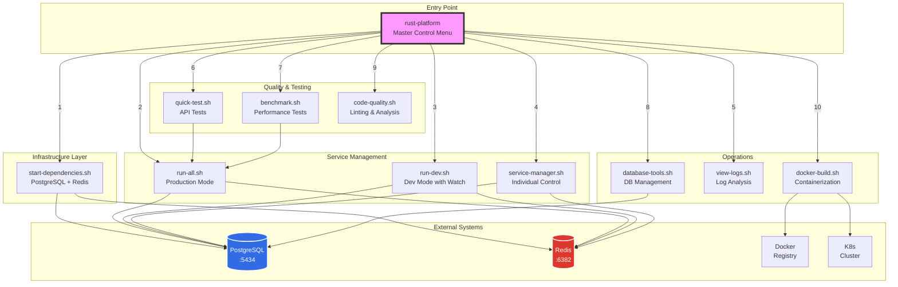

# Scripts Interaction Flow Diagram



## Script Execution Patterns

### Development Workflow
```
1. ./rust-platform → (1) Start Dependencies
                  → (3) Development Mode
                  → (6) Quick Tests (in another terminal)
                  → (5) View Logs (for debugging)
```

### Testing Workflow
```
1. ./rust-platform → (1) Start Dependencies
                  → (2) Start All Services
                  → (6) Quick Tests
                  → (7) Benchmarks
                  → (9) Code Quality Check
```

### Production Deployment
```
1. ./rust-platform → (9) Code Quality (ensure standards)
                  → (10) Docker Build
                  → Push to Registry
                  → Deploy to K8s
```

### Database Operations
```
1. ./rust-platform → (8) Database Tools
                  → Run Migrations
                  → Create Backup
                  → View Statistics
```

## Script Dependencies

| Script | Depends On | Required Tools |
|--------|------------|----------------|
| `rust-platform` | All scripts | bash, nc |
| `start-dependencies.sh` | - | docker, docker-compose |
| `run-all.sh` | cargo | rust, cargo |
| `run-dev.sh` | cargo, cargo-watch | rust, cargo-watch |
| `service-manager.sh` | cargo | rust, ps, lsof |
| `quick-test.sh` | - | curl, jq, nc |
| `benchmark.sh` | - | wrk or hey or ab |
| `code-quality.sh` | cargo, various | clippy, rustfmt, cargo-audit |
| `database-tools.sh` | - | psql, pg_dump |
| `view-logs.sh` | - | tail, grep |
| `docker-build.sh` | - | docker |

## State Management

The scripts manage several types of state:

### 1. **Process State**
- PIDs tracked in `/tmp/rust-services-*.pid`
- Used for graceful shutdown
- Cleaned up automatically

### 2. **Log State**
- Timestamped logs in `logs/` directory
- Rotated based on size/age
- Persistent across runs

### 3. **Database State**
- Migrations tracked in database
- Backups in `backups/` directory
- Schema version management

### 4. **Build State**
- Cargo target directory
- Docker image cache
- Incremental compilation

## Error Handling Strategy

All scripts follow consistent error handling:

1. **Pre-flight Checks**
   - Verify dependencies installed
   - Check ports available
   - Validate environment

2. **Graceful Degradation**
   - Suggest fixes for missing tools
   - Provide alternative commands
   - Continue with reduced functionality

3. **Clear Error Messages**
   - Color-coded (red) errors
   - Specific problem description
   - Actionable solutions

4. **Cleanup on Exit**
   - Stop child processes
   - Remove temporary files
   - Close connections