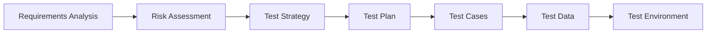

# Testing Methodology

## 1. Test Planning and Design

### 1.1 Test Planning Process


### 1.2 Test Design Techniques

#### 1.2.1 Equivalence Partitioning
Divide inputs into valid and invalid partitions:

**Example: Email Validation**
- Valid: user@domain.com
- Invalid: 
  - No @ symbol: userdomain.com
  - No domain: user@
  - No TLD: user@domain
  - Special chars: user@dom@in.com

#### 1.2.2 Boundary Value Analysis
Test at boundaries of input domains:

**Example: Password Length (8-128 chars)**
- Test values: 7, 8, 9, 127, 128, 129
- Edge cases: empty, null, very long (1000 chars)

#### 1.2.3 Decision Table Testing
Map combinations of conditions to actions:

| Email Valid | Password Valid | 2FA Enabled | Action |
|-------------|----------------|-------------|---------|
| ✓ | ✓ | ✓ | Show 2FA |
| ✓ | ✓ | ✗ | Login Success |
| ✓ | ✗ | - | Password Error |
| ✗ | - | - | Email Error |

#### 1.2.4 State Transition Testing
Test state changes in the application:

```
States: Logged Out -> Logging In -> Logged In -> Logging Out
Transitions: Login, Authenticate, Logout, Session Expire
```

## 2. Test Execution Methodology

### 2.1 Manual Testing Protocol

#### Pre-execution Checklist
- [ ] Test environment ready
- [ ] Test data prepared
- [ ] Previous bugs verified
- [ ] Test cases reviewed
- [ ] Tools configured

#### Execution Steps
1. **Setup**: Prepare test environment
2. **Execute**: Follow test steps precisely
3. **Observe**: Document actual results
4. **Compare**: Verify against expected
5. **Record**: Log results and evidence
6. **Cleanup**: Reset for next test

#### Post-execution
- [ ] Results documented
- [ ] Bugs reported
- [ ] Test data cleaned
- [ ] Metrics updated
- [ ] Feedback provided

### 2.2 Automated Testing Protocol

#### Test Development Workflow
```typescript
// 1. Analyze requirement
// REQ-001: User should be able to login with valid credentials

// 2. Design test scenarios
// - Positive: Valid login
// - Negative: Invalid credentials
// - Edge: Special characters, long inputs

// 3. Implement test
describe('AUTH-FORM-001: Login Functionality', () => {
  // 4. Setup test data
  const testUser = {
    email: 'test@example.com',
    password: 'ValidPass123!'
  };

  // 5. Write test cases
  it('should login with valid credentials', async () => {
    // Arrange
    await page.goto('/login');
    
    // Act
    await page.fill('[name=email]', testUser.email);
    await page.fill('[name=password]', testUser.password);
    await page.click('[type=submit]');
    
    // Assert
    await expect(page).toHaveURL('/dashboard');
  });

  // 6. Cleanup
  afterEach(async () => {
    await page.context().clearCookies();
  });
});
```

## 3. Test Data Management

### 3.1 Test Data Categories

#### Static Test Data
```json
{
  "users": {
    "admin": {
      "email": "admin@test.com",
      "password": "Admin123!",
      "role": "admin"
    },
    "user": {
      "email": "user@test.com",
      "password": "User123!",
      "role": "user"
    }
  }
}
```

#### Dynamic Test Data
```typescript
// Generate unique test data
function generateTestUser() {
  const timestamp = Date.now();
  return {
    email: `test${timestamp}@example.com`,
    password: `Pass${timestamp}!`,
    name: `Test User ${timestamp}`
  };
}
```

#### Boundary Test Data
```typescript
const boundaryData = {
  email: {
    min: 'a@b.c',  // 5 chars
    max: 'a'.repeat(244) + '@test.com',  // 254 chars
    invalid: ['', 'invalid', '@test.com', 'test@', 'test@.com']
  },
  password: {
    min: '12345678',  // 8 chars
    max: 'a'.repeat(128),  // 128 chars
    invalid: ['', '1234567', 'a'.repeat(129)]
  }
};
```

### 3.2 Test Data Lifecycle

1. **Creation**: Generate or import test data
2. **Storage**: Secure storage with encryption
3. **Usage**: Reference in test cases
4. **Maintenance**: Update as needed
5. **Cleanup**: Remove after tests
6. **Archival**: Store results for audit

## 4. Defect Management Process

### 4.1 Defect Lifecycle
```
New -> Assigned -> In Progress -> Fixed -> Testing -> Verified -> Closed
                                    ↓
                                Reopened ←
```

### 4.2 Defect Prioritization Matrix

| Severity | Frequency | Priority |
|----------|-----------|----------|
| Critical | Always | P0 |
| Critical | Sometimes | P1 |
| High | Always | P1 |
| High | Sometimes | P2 |
| Medium | Always | P2 |
| Medium | Sometimes | P3 |
| Low | Any | P3 |

### 4.3 Defect Report Template
```markdown
**Defect ID**: DEF-2025-001
**Title**: Login fails with valid credentials
**Test Case**: AUTH-FORM-001-POS
**Severity**: Critical
**Priority**: P0
**Status**: New

**Environment**:
- Browser: Chrome 120
- OS: Windows 11
- Build: v1.2.3

**Steps to Reproduce**:
1. Navigate to https://app.example.com/login
2. Enter email: admin@test.com
3. Enter password: Admin123!
4. Click Login button

**Expected Result**: 
User should be redirected to dashboard

**Actual Result**: 
Error message "Invalid credentials" appears

**Root Cause**: 
[To be filled by developer]

**Fix Applied**: 
[To be filled by developer]

**Attachments**:
- Screenshot: error-message.png
- Video: login-failure.mp4
- Logs: console-error.txt
```

## 5. Test Environment Management

### 5.1 Environment Configuration

#### Development Environment
```yaml
name: development
database:
  host: localhost
  port: 5434
  name: bookmarks_dev
redis:
  host: localhost
  port: 6382
api:
  url: http://localhost:3001
frontend:
  url: http://localhost:5173
features:
  debug: true
  2fa: false
  rateLimit: false
```

#### Test Environment
```yaml
name: test
database:
  host: test-db
  port: 5432
  name: bookmarks_test
redis:
  host: test-redis
  port: 6379
api:
  url: https://test-api.example.com
frontend:
  url: https://test.example.com
features:
  debug: false
  2fa: true
  rateLimit: true
```

### 5.2 Environment Setup Scripts
```bash
#!/bin/bash
# setup-test-env.sh

# 1. Start services
docker-compose -f docker-compose.test.yml up -d

# 2. Wait for services
./scripts/wait-for-services.sh

# 3. Run migrations
npm run migrate:test

# 4. Seed test data
npm run seed:test

# 5. Verify environment
npm run verify:test-env
```

## 6. Test Execution Patterns

### 6.1 Page Object Pattern
```typescript
// pages/LoginPage.ts
export class LoginPage {
  constructor(private page: Page) {}

  async navigate() {
    await this.page.goto('/login');
  }

  async login(email: string, password: string) {
    await this.page.fill('[name=email]', email);
    await this.page.fill('[name=password]', password);
    await this.page.click('[type=submit]');
  }

  async getErrorMessage() {
    return this.page.textContent('.error-message');
  }
}

// tests/login.spec.ts
test('should show error for invalid login', async ({ page }) => {
  const loginPage = new LoginPage(page);
  await loginPage.navigate();
  await loginPage.login('invalid@test.com', 'wrong');
  
  const error = await loginPage.getErrorMessage();
  expect(error).toBe('Invalid credentials');
});
```

### 6.2 API Testing Pattern
```typescript
// api/BookmarkAPI.ts
export class BookmarkAPI {
  constructor(private request: APIRequestContext) {}

  async create(bookmark: Bookmark, token: string) {
    return this.request.post('/api/bookmarks', {
      headers: { Authorization: `Bearer ${token}` },
      data: bookmark
    });
  }

  async get(id: string, token: string) {
    return this.request.get(`/api/bookmarks/${id}`, {
      headers: { Authorization: `Bearer ${token}` }
    });
  }
}

// tests/api/bookmarks.spec.ts
test('should create bookmark', async ({ request }) => {
  const api = new BookmarkAPI(request);
  const token = await getAuthToken();
  
  const response = await api.create({
    url: 'https://example.com',
    title: 'Example'
  }, token);
  
  expect(response.status()).toBe(201);
  const bookmark = await response.json();
  expect(bookmark).toHaveProperty('id');
});
```

## 7. Test Reporting

### 7.1 Test Execution Report
```markdown
# Test Execution Report
**Date**: 2025-06-16
**Build**: v1.2.3
**Environment**: Staging

## Summary
- Total Tests: 250
- Passed: 245 (98%)
- Failed: 3 (1.2%)
- Skipped: 2 (0.8%)
- Duration: 15m 32s

## Failed Tests
1. AUTH-FORM-002-NEG: Login with invalid password
   - Error: Timeout waiting for selector
   - Duration: 30s
   
2. BOOK-API-003-NEG: Create bookmark with invalid URL
   - Error: Expected 400, got 500
   - Duration: 1.2s

3. PERF-LOAD-001: Dashboard load time
   - Error: Load time 3.5s exceeded threshold 3s
   - Duration: 3.5s

## Coverage
- Statements: 92%
- Branches: 88%
- Functions: 90%
- Lines: 91%

## Recommendations
1. Fix authentication timeout issue
2. Improve error handling for bookmark API
3. Optimize dashboard queries
```

### 7.2 Metrics Dashboard
```typescript
interface TestMetrics {
  execution: {
    total: number;
    passed: number;
    failed: number;
    skipped: number;
    duration: number;
  };
  coverage: {
    statements: number;
    branches: number;
    functions: number;
    lines: number;
  };
  trends: {
    passRate: number[];
    executionTime: number[];
    newDefects: number[];
    automation: number[];
  };
}
```

## 8. Continuous Improvement

### 8.1 Test Optimization
1. **Parallel Execution**: Run independent tests concurrently
2. **Smart Selection**: Run only affected tests
3. **Caching**: Cache dependencies and build artifacts
4. **Cleanup**: Remove obsolete tests
5. **Refactoring**: Consolidate duplicate code

### 8.2 Feedback Loops
- Daily standup test status
- Weekly metrics review
- Sprint retrospectives
- Monthly strategy review
- Quarterly tool evaluation

### 8.3 Knowledge Sharing
- Test documentation
- Best practices guide
- Training sessions
- Code reviews
- Pair testing

## 9. Tools and Utilities

### 9.1 Test Generators
```bash
# Generate test from template
npm run generate:test -- --type=e2e --page=Profile

# Generate API test
npm run generate:test -- --type=api --endpoint=/api/users

# Generate component test
npm run generate:test -- --type=unit --component=Button
```

### 9.2 Test Utilities
```typescript
// Test helpers
export const testHelpers = {
  // Wait for element with retry
  async waitForElement(selector: string, options = {}) {
    const defaults = { timeout: 30000, retry: 3 };
    const config = { ...defaults, ...options };
    // Implementation
  },

  // Generate test data
  generateTestData(type: string, count: number) {
    // Implementation
  },

  // Clean test data
  async cleanupTestData(prefix: string) {
    // Implementation
  }
};
```

## 10. Compliance and Standards

### 10.1 Coding Standards
- ESLint for code quality
- Prettier for formatting
- TypeScript strict mode
- Naming conventions
- Documentation requirements

### 10.2 Testing Standards
- Minimum 80% coverage
- All PRs require tests
- No console.log in tests
- Descriptive test names
- Proper cleanup

### 10.3 Security Standards
- No hardcoded credentials
- Secure test data storage
- Sanitized logs
- Encrypted communications
- Access control